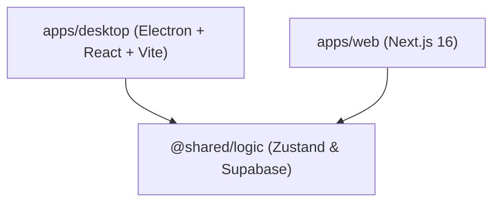
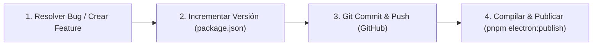

# 🏛️ La Constitución de Magnasoft: Spec-Kit y Manual de Arquitectura

Bienvenido a la **Constitución de Magnasoft / Servicar OV**. Este documento sirve como la **Única Fuente de Verdad (Single Source of Truth)** para el desarrollo, diseño, arquitectura y estándares operativos del sistema. Todos los ingenieros que colaboren en el proyecto deben seguir rigurosamente estas pautas para mantener un código saludable, mantenible y escalable.

---

## 🗺️ 1. Arquitectura del Monorepo

Magnasoft está estructurado como un monorepo administrado con **pnpm**. Esto nos permite separar la lógica de negocio del frontend específico de cada plataforma.



### Componentes de la Arquitectura:
1. **`apps/desktop`**: El Punto de Venta (POS) rápido. Se ejecuta localmente usando **Electron** y **Vite**, garantizando integración nativa con impresoras térmicas (58mm/80mm), bajo retardo y alta fiabilidad en caja.
2. **`apps/web`**: El Tablero de Monitoreo Remoto para el Dueño. Creado con **Next.js**, optimizado para SEO, carga instantánea y responsivo para celulares.
3. **`apps/shared`**: Biblioteca interna compartida. Contiene la integración directa con **Supabase**, tipos de datos de TypeScript unificados, y las tiendas globales de **Zustand** (`useAuthStore`, `useSessionStore`, etc.).

---

## 🎨 2. Spec-Kit: Sistema de Diseño e Identidad Visual

Para que Servicar OV se sienta moderno, sofisticado y de alta gama, se deben respetar las siguientes reglas estéticas. **Queda estrictamente prohibido usar colores crudos o plantillas genéricas.**

### 🎨 Paleta de Colores Curada (HSL)

Usamos un esquema de color vibrante, moderno y con alto contraste, inclinado a tonos premium (Dark Mode por defecto en el POS).

| Token | Propósito | Valor HSL / Hex | Muestra Visual |
| :--- | :--- | :--- | :--- |
| **`Primary`** | Botones principales, acentos activos | `hsl(217.2, 91.2%, 59.8%)` | Azul Eléctrico |
| **`Success`** | Balances positivos, cobros exitosos | `hsl(142.1, 70.6%, 45.3%)` | Verde Esmeralda |
| **`Destructive`**| Anulaciones, egresos rápidos | `hsl(346.8, 84.1%, 50.2%)` | Rojo Rubí |
| **`Background`** | Fondos generales de pantallas | `hsl(222.2, 84%, 4.9%)` | Azul Noche Profundo |
| **`Card`** | Contenedores y modales (Efecto Cristal) | `hsla(222.2, 84%, 7%, 0.7)` | Negro Traslúcido |

### ✨ Estilo Glassmorphism (Efecto de Cristal Templado)
Los modales y tarjetas interactivas del POS deben usar un diseño semitransparente con desenfoque de fondo:
```css
.glass-panel {
  background: rgba(15, 23, 42, 0.7);
  backdrop-filter: blur(12px);
  border: 1px solid rgba(255, 255, 255, 0.08);
  box-shadow: 0 8px 32px 0 rgba(0, 0, 0, 0.37);
}
```

### ⚡ Micro-animaciones Obligatorias
Cada elemento interactivo (botones de cobro, tarjetas de trabajadores, filas) debe reaccionar de forma fluida:
*   **Hover**: Transición suave de 150ms (`transition-all duration-150 ease-out`).
*   **Active/Click**: Efecto de presión tridimensional (`active:scale-[0.98] active:brightness-90`).

---

## 🛠️ 3. Constitución de Código y Estándares de Programación

Para evitar bugs difíciles de depurar en producción (como los errores de ámbito de variables y TDZ), seguimos estas leyes inquebrantables.

### 🚫 Ley #1: Cero Sombreado de Variables (No Variable Shadowing)
Nunca reutilices el nombre de una variable del ámbito superior dentro de una función o bloque interno. Esto causa el temido error **Temporal Dead Zone (TDZ)** al minificar.

> [!CAUTION]
> **CÓDIGO PROHIBIDO ❌**
> ```typescript
> const numericTip = 0; // Ámbito superior
> 
> function handleConfirm() {
>   // ... código
>   const numericTip = parseFloat(tipAmount); // ❌ Redefinición interna. Causa bug fatal en producción (Cannot access 'numericTip' before initialization)
> }
> ```

> [!TIP]
> **CÓDIGO CORRECTO ✅**
> ```typescript
> let numericTip = 0;
> 
> function handleConfirm() {
>   // Simplemente reasigna el valor o usa un nombre distinto
>   numericTip = parseFloat(tipAmount) || 0; 
> }
> ```

### 📦 Ley #2: Evitar Importaciones Estáticas y Dinámicas Cruzadas
Para evitar advertencias de compilación y optimizaciones ineficientes de Rollup:
- Los archivos de `@shared/logic` que tengan dependencias mutuas no deben mezclarse en importaciones estáticas y dinámicas simultáneamente.
- Si una Store (como `useSessionStore`) requiere datos de `useAuthStore`, accede a ellos mediante los selectores o métodos internos del store, no importándolos de forma estática redundante en cada render.

### 🛡️ Ley #3: Manejo Seguro de Nulos en Supabase
El backend en Supabase es dinámico. Las columnas de tipo `jsonb` o metadatos dinámicos pueden no estar completamente estructuradas o contener valores nulos.
- **Siempre** usa encadenamiento opcional (`product.metadata?.color`) y valores por defecto (`product.metadata?.color ?? 'N/A'`).

---

## 🚀 4. Guías de Optimización de Rendimiento Frontend

### 1. Virtualización Obligatoria para Listas Grandes (>100 filas)
No renderices cientos de servicios o productos de golpe. Esto satura el DOM y ralentiza el POS.
*   Usa **TanStack Virtual** (`@tanstack/react-virtual`).
*   Configura tamaños estimados consistentes para evitar saltos bruscos en el scroll (CLS).

### 2. Parseo Memoizado de JSONB
Nunca uses `JSON.parse` directamente en la función de renderizado de un componente React.
*   Implementa `useMemo` para calcular las propiedades complejas únicamente cuando el registro de Supabase cambie.

```tsx
const parsedMetadata = useMemo(() => {
  if (!product.metadata) return {};
  return typeof product.metadata === 'string' 
    ? JSON.parse(product.metadata) 
    : product.metadata;
}, [product.metadata]);
```

### 3. Filtros del Lado del Servidor (Supabase Text Search)
La búsqueda rápida de patentes (placas de vehículos), clientes y servicios debe ocurrir en Supabase usando índices de texto completo. Evita a toda costa descargar miles de registros para filtrarlos con `.filter()` de JS en la aplicación del cliente.

---

## 📝 5. Flujo de Lanzamiento y Despliegues

Cuando se integre una nueva característica o corrección al proyecto, el flujo oficial para actualizar es:



1.  **Validar**: Ejecutar la app localmente con `pnpm electron:dev`.
2.  **Versionar**: Incrementar el patch en `package.json` (ej. `1.0.39`).
3.  **Documentar**: Crear el archivo de notas de lanzamiento `RELEASE_NOTES_v[Versión].md`.
4.  **Desplegar**: Correr el comando de publicación para subir el instalador compilado de forma automática a los Releases de GitHub, asegurando la distribución instantánea de actualizaciones a todos los clientes.

---

*Esta Constitución se revisa y actualiza dinámicamente con el crecimiento técnico de Magnasoft.*
