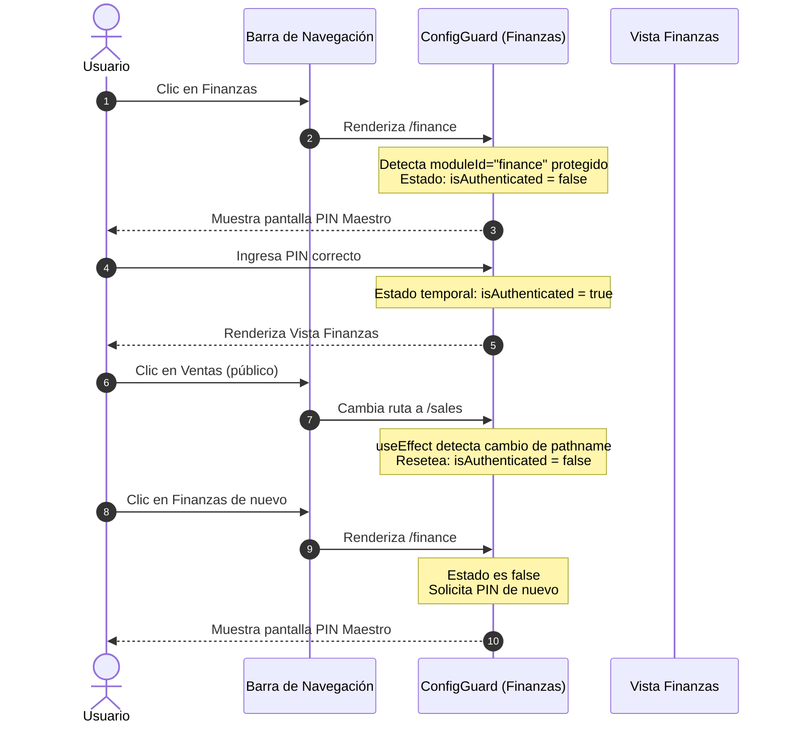

# Especificación: Seguridad de Módulos (Re-autenticación) y Validación Atómica de Ventas

*   **IA/Autor**: Antigravity AI (Google DeepMind Team)
*   **Fecha**: 2026-05-29
*   **Estado**: Borrador (Listo para Revisión)
*   **Módulos Asociados**: `seguridad`, `pos`, `finance`

---

## 1. Objetivos y Alcance

Esta especificación cubre dos refactorizaciones críticas para garantizar la seguridad de acceso a la información y la integridad de las transacciones comerciales en el POS.

### Objetivos Clave
1.  **Seguridad de Módulos (PIN Lock no persistente)**:
    *   Evitar que la autorización por PIN de un módulo de seguridad se mantenga activa al navegar a otros módulos o secciones.
    *   Exigir la introducción del PIN maestro del negocio **cada vez** que el usuario ingrese a un módulo protegido, garantizando que un descuido del operador no deje expuestas áreas administrativas.
    *   Mantener la persistencia estándar del inicio de sesión general (usuario/contraseña de Supabase Auth).

2.  **Validación e Integridad de Ventas (Bloqueo Atómico)**:
    *   Bloquear de forma efectiva la finalización de una venta si no se cumplen los requisitos mínimos (asignación de trabajadores en ítems correspondientes, datos obligatorios de vehículo para servicios o datos de clientes).
    *   Eliminar el comportamiento actual donde se muestra un error post-procesamiento pero la venta ya se ha insertado parcialmente en Supabase (generando registros huérfanos, duplicidad de registros o datos incompletos).
    *   Implementar pre-validaciones estrictas en el frontend y consolidar la transacción para que sea 100% atómica.

---

## 2. Requerimientos del Usuario

### Módulo de Seguridad: Re-autenticación de PIN
| ID | Requerimiento | Descripción / Comportamiento Esperado | Prioridad |
|---|---|---|---|
| REQ-SEC-01 | Re-autenticación al Salir | Si un usuario introduce el PIN correcto en un módulo protegido (ej. `Finanzas`, `Auditoría`, `Inventario`, `Configuración`) y luego navega a cualquier otra pestaña, al regresar al módulo protegido **debe solicitarse el PIN nuevamente**. | Alta |
| REQ-SEC-02 | PIN no compartido | El PIN debe ser exclusivo por módulo. Estar autenticado en `Finanzas` no debe desbloquear automáticamente `Configuración` ni `Auditoría` si estos últimos también están protegidos. | Alta |
| REQ-SEC-03 | Persistencia de Sesión | La sesión general de Supabase (login de cajero/usuario) no debe afectarse; el cajero permanece logueado en la app. | Alta |

### Módulo de POS: Validación y Bloqueo de Ventas
| ID | Requerimiento | Descripción / Comportamiento Esperado | Prioridad |
|---|---|---|---|
| REQ-POS-01 | Pre-validación Estricta | El botón "Confirmar Pago" y el flujo de cobro deben estar bloqueados o lanzar alertas tempranas que **impidan cualquier inserción en la base de datos** si falta: <br>1. Profesional/Responsable (cuando la comisión es obligatoria). <br>2. Vehículo (para servicios automotrices en negocios con módulo de vehículos activo). | Alta |
| REQ-POS-02 | Transacción Atómica | Restructurar el proceso de guardado para garantizar que si falla la inserción de ítems, el registro de comisión, el descuento de stock o la actualización de lealtad, la venta completa se cancele y no se registre a medias. | Alta |
| REQ-POS-03 | UI Predictiva | El selector de trabajador o la sección de vehículo faltante deben resaltar visualmente con bordes rojos y alertas parpadeantes si el usuario intenta cobrar sin haberlos completado. | Media |

---

## 3. Comportamiento de la UI e Interacciones

### 3.1 Flujo de Navegación con PIN Lock
1.  El usuario hace clic en **Finanzas** (módulo protegido).
2.  `ConfigGuard` detecta que el módulo está protegido y muestra la pantalla premium de bloqueo solicitando el **PIN Maestro**.
3.  El usuario introduce el PIN correcto. La vista se desbloquea y el usuario visualiza los datos financieros.
4.  El usuario hace clic en **Ventas** (módulo público). Navega con éxito.
5.  El usuario hace clic de vuelta en **Finanzas**.
6.  `ConfigGuard` detecta el cambio de ruta y fuerza la re-autenticación. Se le vuelve a solicitar el **PIN Maestro** al usuario.



### 3.2 Flujo de Validación de Venta en el POS
1.  El cajero agrega un servicio de "Lavado General" (comisión obligatoria) al carrito.
2.  El cajero intenta presionar **Cobrar** sin haber asignado un mecánico o barbero.
3.  **Comportamiento Esperado**: 
    *   Si es en el carrito: El selector de trabajador parpadea con bordes rojos indicando que es obligatorio asignar un profesional.
    *   Si se abre el modal de pago: El modal muestra inmediatamente el error en color rojo y el botón de "Confirmar Pago" se mantiene deshabilitado (`disabled`), impidiendo que el usuario haga clic para enviar la venta a la base de datos.
4.  Una vez seleccionado el trabajador, el botón "Confirmar Pago" se habilita.

---

## 4. Diseño Técnico y Propuesta de Refactorización

### 4.1 Refactorización: Seguridad de Módulos (`ConfigGuard.tsx`)
Actualmente, `ConfigGuard` almacena el estado de autenticación en un `useState` local:
```typescript
const [isAuthenticated, setIsAuthenticated] = useState(false);
```
Para asegurar que este estado se limpie inmediatamente al navegar (incluso si React Router decide reutilizar la instancia del componente o si hay sub-rutas anidadas que no desencadenan un desmonte completo del componente), se implementará un escucha de la localización actual utilizando el hook `useLocation` de `react-router-dom`:

```typescript
import { useState, useEffect } from 'react';
import { useLocation } from 'react-router-dom';
// ...

export const ConfigGuard = ({ children, moduleId }: ConfigGuardProps) => {
    const location = useLocation();
    const [isAuthenticated, setIsAuthenticated] = useState(false);
    const protectedModules = useBusinessStore((state) => state.protectedModules);
    const isProtected = protectedModules.includes(moduleId);

    // RESET DE AUTENTICACIÓN AL CAMBIAR DE RUTA
    // Limpia el PIN autorizado de forma reactiva al navegar fuera de la ruta actual
    useEffect(() => {
        setIsAuthenticated(false);
    }, [location.pathname]);

    // ...
```

> [!NOTE]
> Al vincular el estado de autenticación de PIN directamente a `location.pathname`, garantizamos de forma absoluta y limpia que cualquier cambio de módulo obligue al usuario a re-autenticarse, cumpliendo con la directiva de no almacenar la clave en ningún almacenamiento persistente del navegador o del store general.

---

### 4.2 Refactorización: Validación Atómica de Ventas (`PaymentModal.tsx` y `POSCart.tsx`)

#### A. Pre-validación Robusta en el Frontend
Antes de realizar cualquier inserción en Supabase, el sistema debe evaluar todas las reglas de negocio y lanzar alertas oportunas. Modificaremos la propiedad `canConfirm` en `PaymentModal.tsx` para incluir todas las restricciones:

```typescript
// En PaymentModal.tsx
const hasServices = items.some(i => i.type === 'service');
const isMissingVehicle = hasVehicles && hasServices && customer?.name !== 'Público General' && !vehicle?.id;
const isMissingWorker = itemsMissingWorker.length > 0;

const canConfirm = 
    !isMissingVehicle &&
    !isMissingWorker &&
    (method === 'cash' ? numericAmount >= total : method === 'credit' ? !!customer : method === 'mixed' ? mixedValid : true);
```

#### B. Evitar Inserciones Parciales (Patrón de Transacción)
Para evitar que se inserte la venta en la tabla `sales` pero falle la inserción en `sale_items` o `worker_commissions` dejando registros corruptos, reestructuraremos el orden de inserción y las validaciones:

1.  **Validaciones síncronas primero**: Verificar conexión a Supabase y vigencia del turno de caja (`cashSession`).
2.  **Inserción en base de datos en un solo bloque**: En lugar de hacer múltiples llamadas secuenciales e independientes desde el cliente, se propone implementar una función RPC (Stored Procedure) en Supabase o, en su defecto, estructurar el guardado con un control de excepciones estricto que alerte inmediatamente y valide las respuestas de forma rigurosa antes de continuar con los pasos no críticos (como la impresión o la lealtad).
3.  **Implementación de RPC Atómica (Recomendado)**:
    Creamos una función de base de datos en Supabase llamada `process_pos_sale` que reciba el payload completo (venta + ítems + comisiones) y realice toda la operación dentro de una transacción SQL (`BEGIN ... COMMIT / ROLLBACK`).
    
    *Ejemplo de firma del RPC en Supabase*:
    ```sql
    CREATE OR REPLACE FUNCTION process_pos_sale(
        p_sale_payload jsonb,
        p_items_payload jsonb[],
        p_commissions_payload jsonb[]
    ) RETURNS jsonb AS $$
    DECLARE
        v_sale_id uuid;
    BEGIN
        -- 1. Insertar Venta
        INSERT INTO sales (...) VALUES (...) RETURNING id INTO v_sale_id;
        
        -- 2. Insertar ítems vinculados a v_sale_id
        -- 3. Insertar comisiones vinculadas a v_sale_id
        -- Si algo falla, PostgreSQL hace ROLLBACK automático
        
        RETURN jsonb_build_object('success', true, 'sale_id', v_sale_id);
    EXCEPTION WHEN OTHERS THEN
        RAISE EXCEPTION '%', SQLERRM;
    END;
    $$ LANGUAGE plpgsql;
    ```

---

## 5. Plan de Verificación Sugerido

### Escenario 1: Seguridad de Módulos (PIN Lock)
1.  Ingresa al módulo **Auditoría**. Introduce el PIN correcto para desbloquear la vista.
2.  Haz clic en **Ventas**.
3.  Regresa inmediatamente a **Auditoría**. Verifica que la pantalla solicite el **PIN Maestro** nuevamente.
4.  Desbloquea **Auditoría** con el PIN. Intenta navegar a **Configuración**. Verifica que se te solicite el PIN en **Configuración** de forma independiente.

### Escenario 2: Integridad de Venta (Bloqueo de Confirmación)
1.  Agrega un servicio con comisión a la venta en el POS.
2.  Abre el modal de cobro y selecciona método "Efectivo".
3.  Verifica que el botón **CONFIRMAR PAGO** se muestre deshabilitado (`disabled`) y se visualice un mensaje de error claro en pantalla indicando la falta de asignación de trabajador.
4.  Asigna el trabajador correspondiente en la vista. Verifica que el error desaparezca y el botón de confirmación se habilite de inmediato.
5.  *(Prueba de robustez)*: Provoca un error de red o de permisos SQL durante la inserción de ítems y verifica que el registro de venta principal no quede guardado en la base de datos (rollback o prevención).
